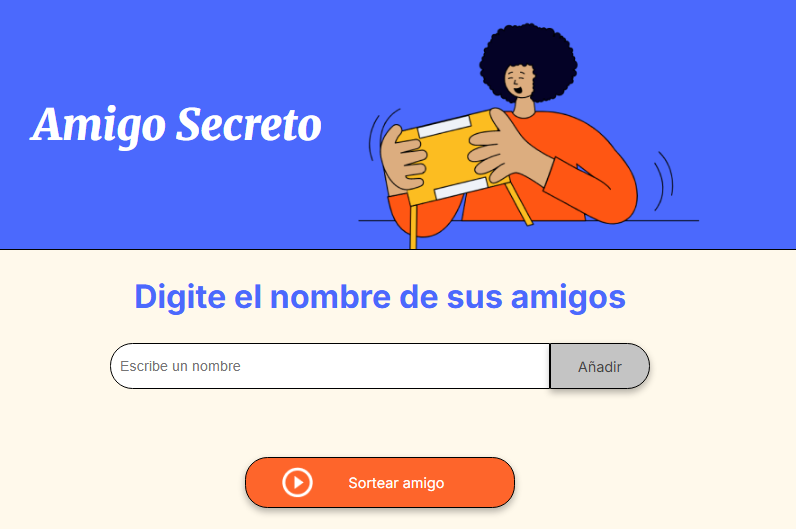
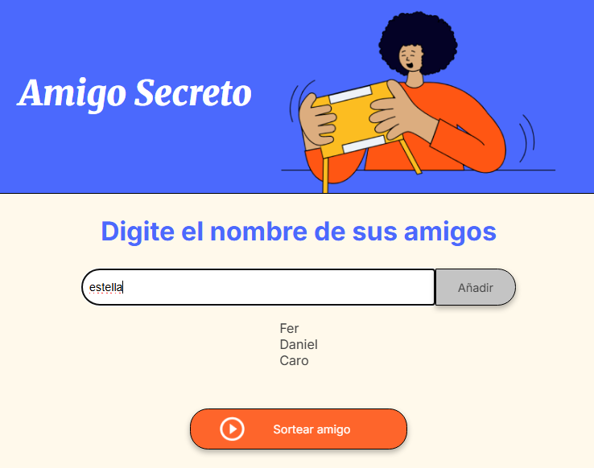
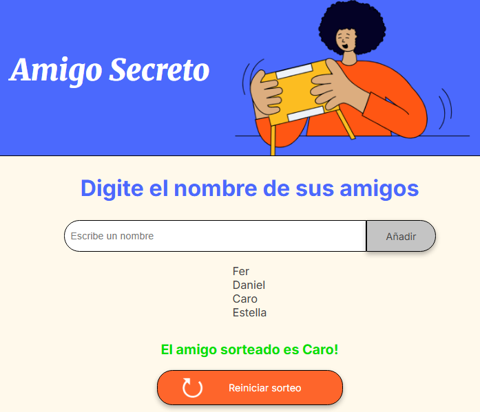
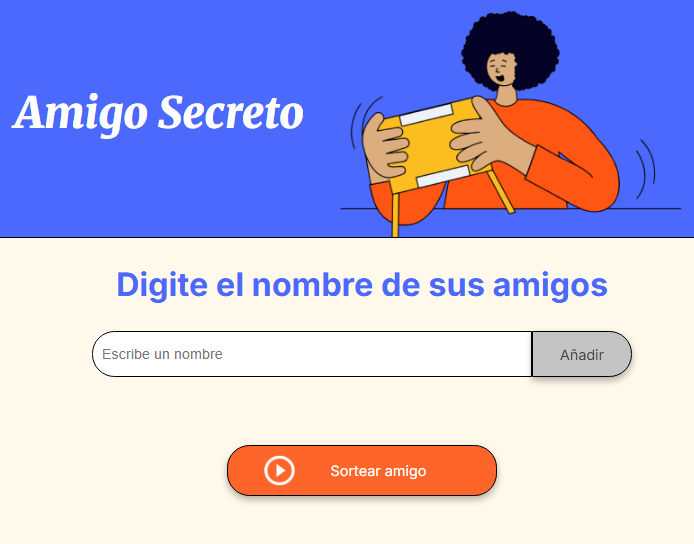

🎯 **Amigo Secreto**

¡Bienvenido al juego de **Sorteo de Amigo Secreto!** Este proyecto forma parte del challenge propuesto por "One Oracle Next Education ®" y "Alura Latam ®". El mismo, consiste en una aplicación web que permite a los usuarios agregar nombres de amigos, realizar un sorteo aleatorio y mostrar al ganador de manera dinámica. También incluye una función para reiniciar el sorteo fácilmente.

🖥️ **Vista Previa**

## 🚀 Características principales

✅ Agrega nombres a una lista.

✅ Realiza un sorteo para seleccionar un amigo al azar.

✅ Muestra dinámicamente el resultado en pantalla.

✅ Permite reiniciar el juego para realizar un nuevo sorteo.

✅ Cambia dinámicamente el botón entre **"Sortear"** y **"Reiniciar"**.

## 🛠️ Tecnologías Utilizadas
    - HTML5: Estructura y diseño de la página

    - CSS3: Estilos visuales

    - JavaScript: Lógica del juego

## 📂 Estructura del Proyecto

📁 src

├── 📄 index.html

├── 📄 style.css

├── 📄 script.js

└── 📁 assets

    ├── play_circle_outline.png

    └── restart_alt.png

## 🚀 Instalación

1. Clona el repositorio en tu máquina local:

    git clone https://github.com/tu-usuario/sorteo-amigo-secreto.git

2. Navega al directorio del proyecto

    cd challenge-amigo-secreto

3. Abre el archivo index.html en tu navegador.

¡Listo! Ya puedes probar el juego. 😎

## 👨‍💻 Uso

1. **Agregar participantes**: 
    Ingresá los nombres en el campo de texto y haz clic en "Añadir"   para   agregar los nombres a una lista que se mostrará debajo del campo de texto.

2. **Sorteo aleatorio**: 
    Al hacer clic en el botón "Sortear amigo", el juego seleccionará un nombre de forma aleatoria y lo mostrará en pantalla. 

3. **Reiniciar**: 
    Una vez que se realiza el sorteo, el botón "Sortear amigo" cambia a "Reiniciar sorteo", al cliclear se limpia la lista de amigos y el resultado, comienza nuevamente el juego!

## Autores

-Mondillo, Maira: implementación de lógica en JavaScript

-**Alura Latam**: Diseño del HTML y CSS.
